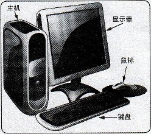
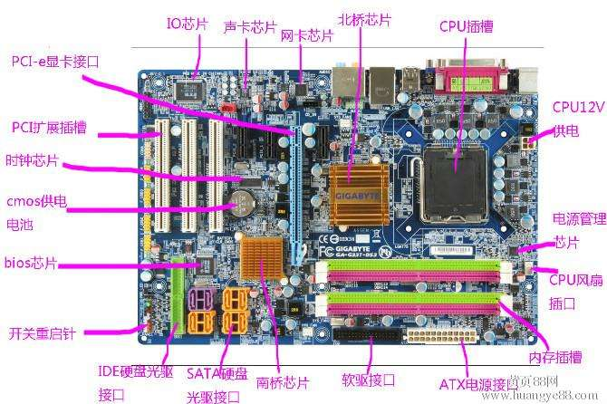
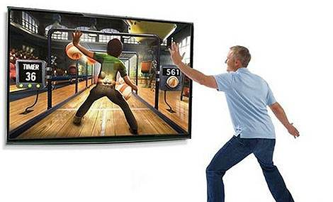
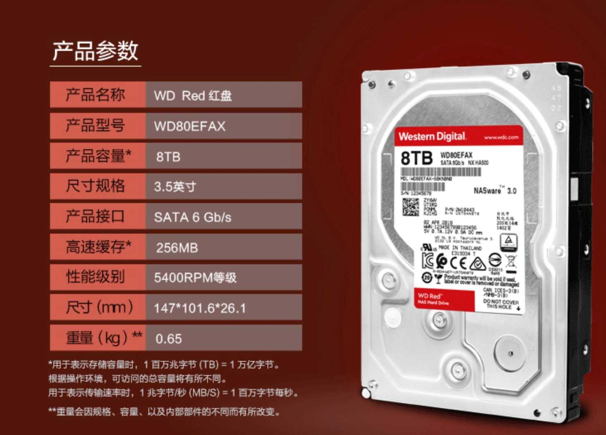

# 计算机基础

Linux就是一个`操作系统`，如同各位所了解的Windows XP、7、10和Mac OS，至于操作系统是什么，这个时代还有人没听过吗？

## 电脑：辅助人脑的工具

现在的人们几乎无时不刻都在使用`电脑`，不管是`桌面型台式机`、`轻薄笔记本`、`平板电脑`、`智能手机`、这些东西都算是电脑。

虽然咱们接触电脑很多，可你知道电脑内部都有什么吗？不同的电脑应用在哪些地方，let's talk about it。


所谓电脑就是一种计算机、也就是`接受使用者输入指令与资料，经由中央处理器的数学与逻辑单元运算处理后，以产生或储存成有用的信息。`因此只要有输入设备、`无论是键盘还是触屏`以及输出设备`电脑屏幕或者打印机列出`，能够产生相关信息，这就是一部计算机。

根据这个定义，以下产品都是计算机

- 小卖部老板娘的计算器
- 隔壁老王不离手的iphone x
- ALex特斯拉车载GPS
- 提款机（ATM）
- 正在学习的你、手中的笔记本
- 新买的Apple Watch


```
没有什么岁月静好，只是有人替你负罪前行。
```

计算机就在背后默默的执行你告知它的任务...


## 计算机与人


如果计算机是一个人体，那么计算机也是有胳膊腿的

- `CPU=脑袋瓜子`：每个人会作的事情都不一样（微指令集的差异），但主要都是通过脑袋瓜子来进行判断与控制身体各部分的活动；
- 内存=脑袋中放置正在被思考的数据的区块`：在实际活动过程中，我们的脑袋瓜子需要有外界刺激的数据 （例如光线、环境、语言等） 来分析，那这些互动数据暂时存放的地方就是内存，主要是用来提供给脑袋瓜子判断用的信息。
- `硬盘=脑袋中放置回忆的记忆区块`：跟刚刚的内存不同，内存是提供脑袋目前要思考与处理的信息，但是有些生活琐事或其他没有要立刻处理的事情， 就当成回忆先放置到脑袋的记忆深处吧！那就是硬盘！主要目的是将重要的数据记录起来，以便未来将这些重要的经验再次的使用；
- `主板=神经系统`：好像人类的神经一样，将所有重要的元件连接起来，包括手脚的活动都是脑袋瓜子发布命令后， 通过神经（主板）传导给手脚来进行活动啊！
- `各项周边设备=人体与外界沟通的手、脚、皮肤、眼睛等`：就好像手脚一般，是人体与外界互动的重要关键！
- `显卡=脑袋中的影像`：将来自眼睛的刺激转成影像后在脑袋中呈现，所以显卡所产生的数据来源也是CPU控制的。
- `电源供应器 （Power）=心脏`：所有的元件要能运行得要有足够的电力供给才行！这电力供给就好像心脏一样，如果心脏不够力， 那么全身也就无法动弹的！心脏不稳定呢？那你的身体当然可能断断续续的～不稳定！


人体在活动的时候，最重要的就是脑袋瓜子，而大脑活动最重要的就是和记忆的交互。

任何外界的接触都必须由记忆记录下来，然后大脑中的CPU再进行判断，再告诉周边的设备，胳膊腿给与响应，如果想要找到以往的经验，那就得去更老的记忆中寻找。

- 人最重要的是脑瓜子
- 计算机最重要的是CPU和内存，CPU的数据来源与内存
- 过往的记忆如同计算机的磁盘，想起来了，就读取

## 计算机硬件

还记得刚毕业时候的你，兴冲冲的去电脑城买电脑...


玲琅满目的商品，你反正就认准了一个道理，`只买贵的，不买对的！`

话说这电脑贵，贵在哪里呢？

答案是：`计算机的配置`

- 更强悍的cpu
- 更大的内存
- 固态硬盘
- 游戏鼠标
- 电竞带鱼屏
- 2080TI显卡
- ...

搞起，LOL、绝地求生...


刚才咱们所说的其实就是图上的元件

计算机的组成部分，就以普通家用主机分析，依次有：

- 输入设备，键盘、鼠标
- 输出设备：屏幕
- 主机部分：机箱、机箱内的零件



躲在主机外壳下的零件

我们主要通过键盘鼠标将数据输入到主机里面，再由主机的处理器进行计算，输出图像或是文本信息输出到屏幕中。


是不是大学里没修过电脑，没追过学妹，看不懂这些计算机硬件？个人笔记本有如上的配置，服务器亦是一样，只不过性能更强悍而已！


### 其他系统硬件



主板上有很多接口，包括网卡、显卡、磁盘阵列等，以及与游戏玩家最看重的显卡，它控制着游戏画面、色彩、分辨率。

以及存储相关，包括内存条、硬盘、软盘、光驱等。

输入设备指的就是触摸屏、键盘鼠标、VR体感游戏设备



输出设备指的就是如电脑屏幕、打印机、音响、投影仪等等

### 计算机用途

```
超级计算机
```

超级计算机是运行速度最快的电脑，但是他的维护、操作费用也最高！主要是用于需要有高速计算的计划中。 例如：国防军事、气象预测、太空科技，用在仿真的领域较多。


```
大型计算机
```

大型计算机通常也具有数个高速的CPU，功能上虽不及超级计算机，但也可用来处理大量数据与复杂的运算。 例如大型企业的主机、全国性的证券交易所等每天需要处理数百万笔数据的企业机构， 或者是大型企业的数据库服务器等等。


```
工作站
```

工作站的价格又比迷你电脑便宜许多，是针对特殊用途而设计的电脑。在个人电脑的性能还没有提升到目前的状况之前， 工作站电脑的性能/价格比是所有电脑当中较佳的，因此在学术研究与工程分析方面相当常见。


```
微型电脑
```

属于个人笔记本、台式机等


### 计算机单位

```
容量单位
```

对于计算机而言，只认识一个叫做`二进制`的容量单位，我们称之为`bit`，但是由于`bit`单位太小，计算机又用`Byte`单位来统计

```
1 Byte = 8 bit
```

同样的，由于计算机存储越来越大，Byte也太小了，计算机又出现简化的单位KB、MB、GB、TB


#### 商家坑了你的硬盘吗？


或许某位同学遇见过这样的问题：

你买了一块1TB的硬盘，但是格式化后发现只有930GB左右。这是因为计算机单位是1024GB=1TB

而厂家磁盘计算是1000GB=1TB，因此容量在转换的时候，产生了缩水。

# CPU中央处理器

服务器的 CPU 相当于人体的大脑，负责计算机的运算和控制，是服务器性能效率的最核心部件。

常见品牌:Intel，AMD

需要记忆的就是，32位CPU和64位CPU，对内存的支持。

32位和64位意味着处理器可在一段时间内处理的最大位数，最大内存寻址空间。

```
# 2的32次方，32位CPU最大支持4G内存
# 32位系统的最大寻址空间约为4294967296（比特）＝4（GB）；
>>> 2**32/1024/1024
4096.0

# 64位CPU，支持相当大的内存扩展
# 总之，它相当大就是，所以64位CPU没问题
>>> 2**64/1024/1024/1024/1024/1024
16384.0  EB
```

关于容量单位换算

下面先按顺序给出所有单位：Byte、KB、MB、GB、TB、PB、EB、ZB、YB、DB、NB

```perl
1Byte = 8 Bit

1 KB = 1,024 Bytes

1 MB = 1,024 KB = 1,048,576 Bytes

1 GB = 1,024 MB = 1,048,576 KB = 1,073,741,824 Bytes

1 TB = 1,024 GB = 1,048,576 MB = 1,073,741,824 KB = 1,099,511,627,776 Bytes

1 PB = 1,024 TB = 1,048,576 GB =1,125,899,906,842,624 Bytes （13107.2个80G的

1 EB = 1,024 PB = 1,048,576 TB = 1,152,921,504,606,846,976 Bytes

1 ZB = 1,024 EB = 1,180,591,620,717,411,303,424 Bytes

1 YB = 1,024 ZB = 1,208,925,819,614,629,174,706,176 Bytes
```

## CPU型号


至强Xeon是英特尔生产的微处理器，它用于"中间范围"的企业服务器和工作站。

在英特尔的服务器主板上，最多达八个Xeon处理器能够共用100MHz的总线而进行多路处理。

Xeon设计用于因特网以及大量的数据处理服务，例如工程、图像和多媒体等需要快速传送大量数据的应用。

> 服务器的 CPU 相当于人体的大脑，负责计算机的运算和控制，是服务器性能效率的最核心部件。

常见品牌:Intel，AMD

- 一般企业里的服务器，CPU 个(颗)数为 2-4 颗，单个(颗)CPU 是四核，内存总量一般是 16G-256G(32G，64G)
- 做虚拟化的宿主机(安装 vmware(虚拟化软件)的服务器)，CPU 颗数 4-8 颗，内存总量一般是 48G-128G，6- 10 个虚拟机。


无论是手机还是电脑，整个机器的最核心部件就是`中央处理器(Central Processing Unit, CPU)`

CPU读取的数据都是从内存而来，内存中的数据从键盘等输入单元而来。

CPU处理完毕的数据也必须写回内存中，最后到输出设备


如图的流向，所有的数据都是经过内存再转出去，这个出/入是CPU发出的控制命令

CPU要处理的数据完全来自于内存，无论是应用程序还是文件读取，都是加载到内存中。

这就是为什么买计算机内存一定要足够大，机器运转就很流畅


# 内存


内存是计算机中最重要的部件，它是计算机中的一个中间件。

解决了CPU和硬盘之间速度严重不对等的问题，是CPU和硬盘数据交互的桥梁。

默认情况下，CPU从内存读写数据，内存从硬盘读写数据。

为了提升效率，一般在开机或者软件在运行的时候，会将常用数据直接从硬盘直接读入内存，以待后续CPU使用，提高计算机运行效率。


内存是电脑的一个临时存储器，它只负责电脑数据的中转而不能永久保存。

作用:内存是 CPU 能够直接访问的存储器，CPU 从内存中读取操作指令和数据，又把运算或处理结果送回内存。

## 特点

1. - 内存的容量和处理速度直接决定了电脑数据传输的快慢。

2. - 一般程序运行的时候会被调度到内存中执行，服务器关闭或程序关闭之后，数据自动从内存中

     释放掉。

   - 内存和 CPU、硬盘一起并称为电脑的三大件。

## 内存种类

CPU使用的所有数据都来自于内存(main memory)，无论是软件或是数据，都必须读入到内存CPU方可调用。

我们平时使用的主要叫做`动态随机存取内存`，`（Dynamic Random Access Memory, DRAM）`

此内存特点是必须通电时才可以使用，断电后数据丢失

内存的发展主要是

- DDR
- DDR2
- DDR3
- DDR4
- DDR5


**品牌**

内存条分为：笔记本、台式机两种

```
台式机
```


```
笔记本
```


## 多通道设计

电脑卡？加内存就行！

由于所有的数据都放在内存才行，所以内存量是越大电脑越快

但是你得注意两只内存最好相同品牌，相同频率，型号最好都一样，这是因为芯片组厂商将两个内存汇聚到一起，好比一只是64位，两只就是128位，这是`双通道`的概念。

双通道下内存下，数据是`同步读/写`到一对内存中，能够提升整体性能


# 风扇


由于CPU需要大量运算，因此发热量很高，必须安装一颗风扇主动进行散热。

不同的CPU型号有着不同的脚位，搭配的主板芯片也不同，因此如果你要升级电脑性能，购买CPU的时候一定要看好插槽是否支持。

目前主流的CPU是以稳定性著称的Intel和速度快的AMD，因此办公类使用Intel较多，游戏玩家机器多是AMD。

## 显卡风扇


# 电源

机箱用来装载计算机硬件，对硬件起到防尘，保护的作用，也有相应的防静电等作用

1）抗静电

2）机箱质量

3）机箱散热

4）机箱质量不易变形

5）机箱空间能满足扩展需求


## 电源供应器（Power）

在机箱内，有一个大大的特盒子，包含着很多电源线，这个就是电源供应器了。

计算机硬件中的CPU、内存、主板、硬盘等等都必须得供电方可使用，随着硬件性能逐步提升，性能较差的电源很可能造成供电不足，导致内存数据丢失等等问题。

- 服务器电源就是指使用在服务器上的电源(POWER)，它和 PC(个人电脑)电源一样，都是 一种开关电源。
- 服务器电源按照标准可以分为 ATX 电源和 SSI 电源两种。ATX 标准使用较为普遍，主要用于台 式机、工作站和低端服务器;而 SSI 标准是随着服务器技术的发展而产生的，适用于各种档次的服务器。
- 服务器电源相当于人体的心脏，保障电源供应，要选择质量好的电源。
- 生产中一般单个服务器核心业务最好使用双电源 **AB** 线路。
- 如果集群(一堆机器做一件事)的情况可以不用双电源。


## UPS不间断电源

UPS（Uninterruptible Power System/Uninterruptible Power Supply），即不间断电源，是将蓄电池（多为铅酸免维护蓄电池）与主机相连接，通过主机逆变器等模块电路将直流电转换成市电的系统设备。

主要用于给单台计算机、计算机网络系统或其它电力电子设备如电磁阀、压力变送器等提供稳定、不间断的电力供应。

当市电输入正常时，UPS 将市电稳压后供应给负载使用，此时的UPS就是一台交流式电稳压器，同时它还向机内电池充电；

当市电中断（事故停电）时， UPS 立即将电池的直流电能，通过逆变器切换转换的方法向负载继续供应220V交流电，使负载维持正常工作并保护负载软、硬件不受损坏。

UPS 设备通常对电压过高或电压过低都能提供保护。


# 硬盘

我们的生活已经离不开电脑，日常工作，娱乐，影音都离不开计算机，它能够帮我存储大量的资料

- 学籍档案
- 工业数据
- 股票资产
- 英语资料

这些数据都是需要被记录与读取，能够存储很久的，存储介质有

- 机械硬盘
- 固态硬盘
- 软盘
- DVD
- U盘
- ...



**由于计算机在工作时，CPU、输入输出设备与存储器之间要大量地交换数据，因此存储器的 存取速度和容量也是影响计算机运行速度的主要因素之一。**

**特别是在服务器优化场景，硬盘的性能 是决定网站性能的重要因素。**

磁盘就是永久存放数据的存储器，磁盘上也是有缓存的(芯片)。

常用的磁盘(硬盘)都是 3.5 英寸的(sas,sata)，常规的机械硬盘，读取(性能不高)性能比内存 差很多，所以，在企业工作中，我们才会把大量的数据缓存到内存，写入到缓冲区，这是当今互联 网网站必备的解决网站访问速度慢的方案。

目前常用的硬盘分为`机械硬盘`和`固态硬盘`两种，相比来说，`固态硬盘速度快但是容量较小，价格高`；

机械硬盘`速度慢但是容量大，价格便宜。`

## 机械硬盘


常见的硬盘内部构造如图，由圆形盘片、磁头臂、磁头、主轴马达组成。

我们电脑的数据都是写入在磁性的磁盘片上，`对磁盘进行读写的操作其实是这样`

- 主轴马达让磁盘转动
- 机械手臂可以伸展让磁头在磁盘上进行读写的动作


## 盘片数据


## SATA接口


SATA是Serial ATA的缩写，即串行ATA。它是一种电脑总线，主要功能是用作主板和大量存储设备(如硬盘及光盘驱动器)之间的数据传输之用。

## 固态硬盘


传统机械磁盘由于在启动的时候，需要驱动马达转动磁盘片，然后再确定数据再哪个扇区，再让磁头正确的读取数据，整个读取速度延迟是很高的！并且机械磁盘由于马达转动，工作时候会有震动伴随着些噪音。

因此厂商就用闪存制作成大容量的设备，依旧使用SATA或是SAS的接口，此类设备没有磁头与盘片，都是内存，和传统机械磁盘不同（Hard Disk Drive ，HDD），称之为固态硬盘（Solid State Disk 或 Solid State Driver, SSD）。

**HDD在运行时需要转动，所以抗震能力和性能比较弱，而且待机转动时功耗也更高一些（停转除外），读写时会有明显“吱”的声响。**

**SSD没有机械结构转动，所以抗震能力很强，性能也更好，同时功耗也低很多，工作时没有声音。**

SSD通过内存直接读写，数据几乎没有延迟且很快速

SSD的缺陷是有写入次数限制，通常SSD寿命为两年，可以用RAID机制保护SSD。

# 主板

> 主板是计算机中最重要的平台部件，也是电脑中最大的集成电路板，它直接或间接的将所有的设备连接在一起。主板的好坏直接决定了计算机速度的快慢和运行稳定。

同时主板也提供了大量的设备接口，为计算机扩展功能提供了可能。

主板一般为矩形电路板，上面安装了组成计算机的主要电路系统，一般有BIOS芯片、I/O控制芯片、键和面板控制开关接口、指示灯插接件、扩充插槽、主板及插卡的直流电源供电接插件等元件。

现在主板一般情况下都集成了三卡(显卡、网卡、声卡)，也有的只集成了声卡和网卡。


## BIOS

很多游戏玩家都喜欢玩“超频”，将CPU的倍频或者外频通过主板的BIOS功能调整为更高的频率，从而提升性能。

但是由于频率非正常速度，可能会造成死机蓝屏。

这个BIOS是在你开机的时候，按下【DEL、F12、F11】等按键进入的一个系统画面

BIOS（Basic Input Output System）是一套程序，这套程序是写死到主板上面的一个内存芯片中， 这个内存芯片在没有通电时也能够将数据记录下来，那就是`只读存储器（Read Only Memory, ROM`）。

> BIOS 对电脑系统来讲是非常重要的，因为他掌握了系统硬件的详细信息与开机设备的选择等等。
>
> BIOS就是你主板内置的一个微型系统，可以修改硬件的参数，比如让我们开启CPU虚拟化支持功能。
>
> 在学习虚拟化技术的时候，如果不支持VT，也是在BIOS这里修改CPU的设置的！


这样的修改动作是被记录到主板上的一个CMOS的芯片上，这个芯片需要额外的供电才可以达到记录功能，这就是为什么主板上有一块电池的原因！


# 显卡


- 是计算机中最重要的图像输出设备
- 是将计算机系统所需要的显示信息进行转换驱动显示器，并向显示器提供逐行或隔行扫描信号，控制显示器的正确显示
- 是连接显示器和个人计算机主板的重要组件
- 是“人机对话”的重要设备之一

显卡对于图像的显示至关重要，因为图像的显示会占用内存，因此显卡一般都会有一个内存的容量，这个显存容量的大小影响到屏幕分辨率与色彩的深度。


早期一些3D运算工作还是交给CPU完成，但是CPU的任务太多，无力再去处理大量的图形计算，显卡厂家在显卡中嵌入了GPU加速的芯片。

对于一些大型3D游戏，要求显卡的运算能力也很高，数据传输也是越快越好。


### 挖矿与显卡

简单来说，挖矿就是**利用芯片进行一个与随机数相关的计算**，得出答案后以此换取一个虚拟币。

虚拟币则可以**通过某种途经换取各个国家的货币**。

运算能力越强的芯片就能越快找到这个随机答案，理论上单位时间内能产出越多的虚拟币。

由于关系到随机数，只有恰巧找到答案才能获取奖励。

有可能一块芯片下一秒就找到答案，也有可能十块芯片一个星期都没找到答案。

越多芯片同时计算就越容易找到答案，内置多芯片的矿机就出现了。

而多台矿机组成一个“矿场”同时挖矿更是提高效率。

而矿池则是由多个“个体户”加入一个组织一起挖矿，无论谁找到答案挖出虚拟币，所有人同时按贡献的计算能力获得相应的报酬，这种方式能使“个体户”收入更稳定。


举一个通俗的例子：

- 我在一张纸上随便写一串数字，给出部分提示，谁猜对就给他奖金（挖矿）
- 聪明的人根据提示能作出更多猜测（计算能力）
- 有人出钱请许多人回来一起猜测（矿场）
- 有人召集大家一起猜测，无论谁猜到，按照每个人猜测次数比例分配奖金（矿池）

由这个例子可以看出，越聪明的人能够计算的越快，机会也越大，收益也更多。

因此比特币挖矿所需的计算芯片也需要更强大，芯片也从CPU 升级到GPU，计算能力更强，相应的越容易挖出虚拟币。

> 公司里如果有一些机器学习的业务，会需要用到显卡，超哥就参与过一个深度学习，需要使用万兆网卡，对k8s环境调参。

### 显卡参数

如果你不是为了挖矿或是游戏使用，仅仅作为网络服务器，入门级的简单显卡也就足够，因为很少会进行图像处理，且linux服务器大多都是无图形化的。

显卡与主机连接的接口如下：


- VGA，模拟信号传输，主要为15针的连接，较老
- DVI，常与液晶屏幕的连接
- HDMI， 主流连接方式可以同时传输图像与声音，广泛应用在电视屏幕与台式机
- Display port，未来传输方式主流，可以同时传输图像与声音

# 网卡

网卡，又称网络适配器或网络接口卡（NIC），英文名为Network Interface Card。

在网络中，如果有一台计算机没有网卡，那么这台计算机将不能和其他计算机通信，它将得不到服务器所提供的任何服务了。

当然如果服务器没有网卡，就称不上服务器了，所以说网卡是服务器必备的设备，就像普通PC（个人电脑）要配处理器一样。

> 平时我们所见到的PC机上的网卡主要是将PC机和LAN（局域网）相连接，而服务器网卡，一般是用于服务器与交换机等网络设备之间的连接。


## 无线网卡

无线网卡和普通电脑网卡作用一样，用来连接局域网。

它只是一个信号收发的设备，必须在已有无线网络环境下才能够使用，和有线网卡的区别只是不通过有线连接，采用无线信号连接的网卡设备。

无线网卡区分：

- USB无线上网卡


- 台式机的PCI无线接口网卡

  

- 笔记本电脑内置的 MINI-PCI 无线网卡。

  

## 常见网卡故障

现在大多数笔记本都自带了无线网卡设备，在没有有线环境下，无线网卡能够更灵活的接入wifi上网，在网络出现故障的时候，该如何解决呢

1.网卡是否插好

确保不同接口类型的网卡，比如插入到位，确保网卡与计算机插槽之间紧密接触，否则计算机无法识别。

2.USB驱动是否正常

在使用USB无线网卡时，确保USB端口打开，驱动正常工作，计算机能够识别USB硬件，方可使用

3.无线客户端无法上网

- 确保无线网卡在无线网络范围内，举例合适，否则信号很弱
- 确保无线网络正常供电，否则无线客户端也无法连接
- 确保正确的IP网络配置
