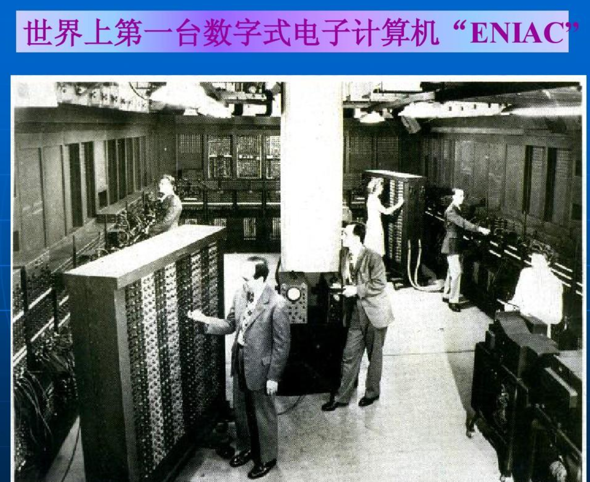
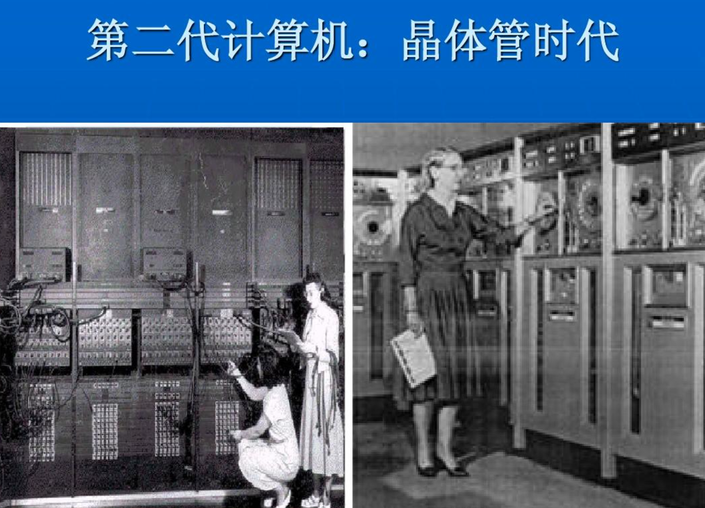

# 操作系统概述

# 计算机发展史

> 计算机的发展阶段，从硬件发展来说可以用“代”来表示，从1946年算起，至今已经经历了四代。

## 第一代计算机

第一代是电子管计算机时代，运算速度慢，内存容量小，使用机器语言和汇编语言编写程序。

主要用于军事和科研部门的科学计算。

## 第二代

第二代计算机： 第二代是晶体管计算机时代，其主要特征是采用晶体管作为开关元件，使计算机的可靠性得到提高，而且体积大大缩小，运算速度加快，其外部设备和软件也越来越多，并且高级程序设计语言应运而生。所谓高级语言，就是更适合人类阅读的开发语言，C语言诞生了。

## 第三代

第三代计算机： 第三代计算机是中、小规模集成电路计算机时代，它是以集成电路作为基础元件，这是微电子与计算机技术相结合的一大突破，并且有了操作系统。

## 第四代

第四代计算机： 第四代计算机是大规模集成电路(Large Scale Integration)和超大规模集成电路(VLSI)时代，软件方面发展了数据库系统，分布式操作系统，网络软件等。

1967年和1977年分别出现了大规模和超大规模集成电路。由大规模和超大规模集成电路组装成的计算机，被称为第四代电子计算机。

# 计算机组成

CPU、内存、风扇、硬盘、显示器、主板、电源、声卡、网卡、显卡、鼠标、键盘等

# 计算机资源

我们即将学习操作系统，操作系统管理计算机的软件、硬件资源。

## 硬件资源

指的是真实存在的物理资源，看得见，摸得着的机器配件。

CPU、内存、显示器、键盘、鼠标等。

## 软件资源

软件指的是数据、 应用程序，计算机世界里看不见，摸不着的资源，一断电啥都不是的资源。

- 游戏、word、微信、QQ
- 程序员写的代码
- linux操作系统、windows

## 操作系统的作用

操作系统管理计算机硬件如下事务

- 处理器资源：轮到哪个任务来占用处理器资源？
- 内存资源：程序、数据在内存中如何分配存储空间？
- 设备管理：如何分配、释放和使用设备？
- 信息资源管理：如何访问文件信息？
- 信号资源管理：如何管理进程之间的通信？

> 简单理解，我们玩英雄联盟的过程

于超老师的笔记本，点击开机，加载windows10操作系统 （硬件+软件）

↓

通过键盘，鼠标，选择点击英雄联盟，双击打开（硬件+软件）

↓

CPU去`我的磁盘D`找到英雄联盟游戏文件（软件）

↓

英雄联盟游戏文件数据加载到内存中，游戏读取进度条中（软件）

↓

游戏开始运行，显示屏上看到激烈团战的画面。（软件+硬件）

> 用户，通过输入设备（键盘鼠标）发送指令给操作系统（软件资源），读取游戏文件（再去操控内存，磁盘资源），最终加载游戏，开始玩耍。

可见，操作系统，是用户 > 硬件 > 软件 之间的桥梁。
